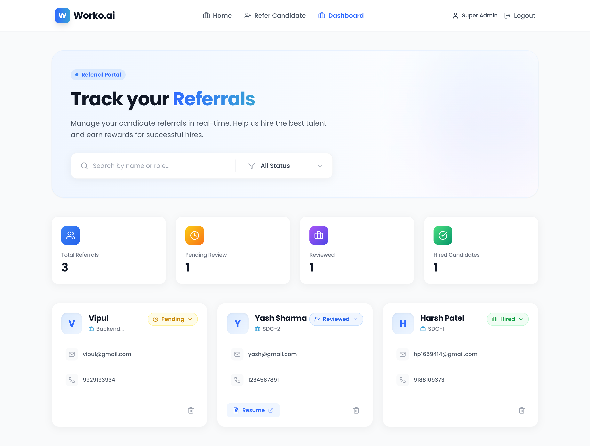

# Candidate Referral Management System (Worko.ai)

A full-stack web application designed to streamline the candidate referral process. Built with a modern, responsive UI inspired by Worko.ai's premium aesthetic, it features secure role-based access control, real-time status tracking, and a comprehensive admin dashboard.

### [Live Demo](https://worko-ai-frontend.vercel.app/)



## Features

### Public Portal
- **Landing Page:** A visually engaging introduction to the referral program.
- **Referral Submission:** Easy-to-use form for submitting candidate details and resumes (PDF support).
- **Secure Registration:** Users can sign up for an account to track their referrals.

### Admin Dashboard (Protected)
- **Single Admin Policy:** A dedicated Super Admin account (`admin@worko.com`) with full system access.
- **Metrics Hub:** Real-time statistics on Total Referrals, Pending Reviews, and Hires.
- **Candidate Management:** View, Search, Filter, Update Status, and Delete candidates.
- **RBAC:** Strict access control ensuring only authorized personnel can modifying data.

## 🛠️ Tech Stack

### Frontend
- **Framework:** React 18 (Vite)
- **Styling:** Tailwind CSS v3 (Custom Configuration)
- **Icons:** Lucide React
- **Routing:** React Router DOM v6
- **State Management:** React Context API (Auth)

### Backend
- **Runtime:** Node.js
- **Framework:** Express.js
- **Database:** MongoDB (Mongoose ODM)
- **Authentication:** JSON Web Tokens (JWT) & bcryptjs
- **File Uploads:** Multer

## Installation & Setup

### Prerequisites
- Node.js (v14+)
- MongoDB (Local or Atlas URI)

### 1. Clone the Repository
```bash
git clone https://github.com/yourusername/candidate-referral-system.git
cd candidate-referral-system
```

### 2. Backend Setup
Navigate to the backend folder and install dependencies:
```bash
cd backend
npm install
```

Create a `.env` file in the `backend` directory:
```env
PORT=5001
MONGO_URI=your_mongodb_connection_string
JWT_SECRET=your_jwt_secret_key
JWT_EXPIRE=30d
JWT_COOKIE_EXPIRE=30
```

Start the backend server (Admin account will be auto-seeded):
```bash
npm run dev
```

### 3. Frontend Setup
Open new terminal and navigate to the frontend folder and install dependencies:
```bash
cd frontend
npm install
```

### 4. Database Seeding (Important)
To create the **Admin Account** (`admin@worko.com`), run the following command:
```bash
npm run seed
```
*(This is safe to run multiple times; it will create the admin if missing or reset the password if it exists.)*

## Assumptions & Limitations
- **Resume Storage:**
    - In local development, resumes are stored in the `backend/uploads` directory.
    - **On Render (Free Tier):** Resumes are stored on an *ephemeral* filesystem. This means uploaded files will disappear if the server restarts or redeploys. For a production app, we would use AWS S3 or Google Cloud Storage (as noted in the optional requirements), but for this assignment, local storage was implemented to demonstrate file handling logic.
- **Email/Phone Validation:** Basic regex is used for validation. In a real-world scenario, we might use stricter libraries or SMS/Email verification.
```bash
cd ../frontend
npm install
```

Start the development server:
```bash
npm run dev
```

## Credentials

### Super Admin
- **Email:** `admin@worko.com`
- **Password:** `Workoadmin123`
*(Note: This account is automatically created when the backend server starts if it doesn't exist.)*

### Regular User
- **Email:** `user@example.com` (Register via the Signup page)
- **Role:** Restricted to "User" by default (Cannot access Dashboard).

## API Endpoints

### Authentication
- `POST /api/auth/register` - Register a new user
- `POST /api/auth/login` - Login user/admin
- `GET /api/auth/me` - Get current user profile

### Candidates
- `GET /api/candidates` - Get all candidates (Admin/User)
- `POST /api/candidates` - Submit a new referral (Public)
- `GET /api/candidates/stats` - Get referral statistics (Admin)
- `PUT /api/candidates/:id/status` - Update candidate status (Admin)
- `DELETE /api/candidates/:id` - Delete a candidate (Admin)

